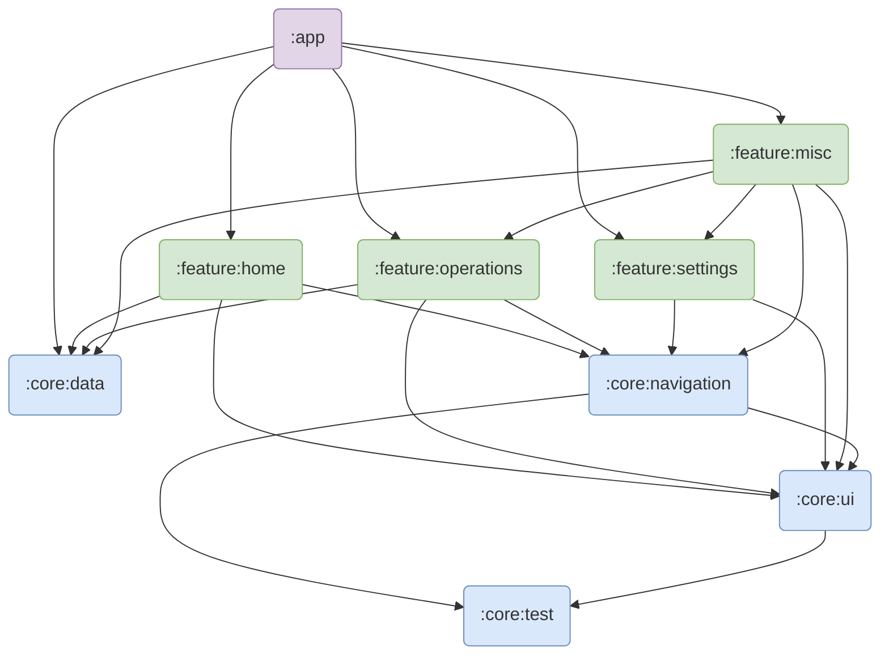
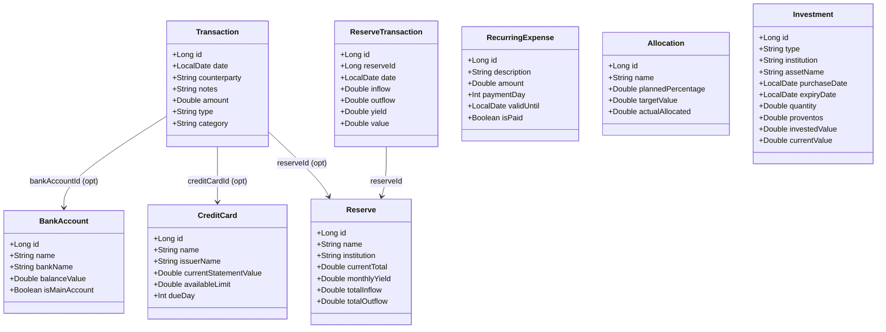

# ComFin

**ComFin** is a financial companion app designed to help you organize and track your personal finances in a simple and intuitive way, eliminating the need for spreadsheets.

## Features

- Manage and monitor income and expenses
- Track reserves (savings) with yield history
- Monitor credit card invoices and bank balances
- Set income allocations and monthly limits
- Manage recurring expenses and investment portfolio
- Modern UI with Jetpack Compose

## Technologies and Architecture

MVVM + MVI across a multi-module Gradle project.

- **Jetpack Compose** — UI
- **Room** — local persistence
- **Koin** — dependency injection
- **Coroutines + Flow** — async data streams

## Module Structure



> Full diagram: [`docs/modules_dependency_map.drawio.xml`](docs/modules_dependency_map.drawio.xml)

## Domain Model



> Full diagram: [`docs/domain-classes.drawio.xml`](docs/domain-classes.drawio.xml)

## Getting Started

Requirements: Android Studio, JDK 17+, Android device or emulator.

```bash
git clone https://github.com/rbrthmn/comfin.git
```

Open in Android Studio and run.

## Contributions

Contributions are welcome. Open issues and submit pull requests.

## Licensing

This project includes code licensed under the Apache License 2.0. See [LICENSE-APACHE](http://www.apache.org/licenses/LICENSE-2.0).
