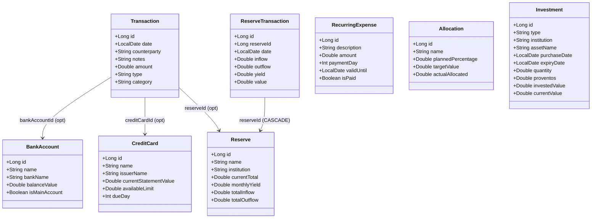

# ComFin

**ComFin** is a personal finance companion app for Android that helps you organize and track your finances — eliminating the need for spreadsheets.

## Features

| Screen | What it does |
|---|---|
| **Home** | Overview of total balance, credit card invoices, monthly spending vs limit |
| **Operations** | Log and browse income/expense transactions filtered by month |
| **Reserves** | Track savings accounts with inflow, outflow, and monthly yield history |
| **Investments** | Monitor investment portfolio (type, institution, value, proventos) |
| **Income Divisions** | Set planned allocation percentages per category and track actuals |
| **Recurring Expenses** | Manage fixed monthly bills with payment day and validity period |
| **Settings** | App configuration |

## Tech Stack

| Layer | Technology |
|---|---|
| UI | Jetpack Compose + Material 3 |
| Architecture | MVVM + MVI (Contract pattern) |
| DI | Koin |
| Local DB | Room + KSP |
| Async | Kotlin Coroutines + Flow |
| Testing | JUnit · Mockk · Compose UI Test · Koin Test |
| Build | Gradle (multi-module) · Java 17 |

## Architecture

MVVM + MVI across a multi-module Gradle project. Each screen has a `Contract` defining `UiState`, `Intent`, and an abstract `ViewModel`.

**Data flow:**
```
User action → onIntent() → ViewModel → MutableStateFlow → UI collectAsState()
```

**Data layer pattern:** Each `data:X` module exposes a `Repository` interface backed by a `Local{X}DataSource` (Room). The local datasource assembles data from multiple DAOs internally — ViewModels receive ready-to-use domain objects with no joins. Swapping to a remote API means binding the interface to a `Remote{X}DataSource` via DI, with zero changes to ViewModels.

## Module Structure

> Open interactive diagram in diagrams.net: [docs/modules_dependency_map.drawio.xml](docs/modules_dependency_map.drawio.xml)

**Legend:**

| Color | Layer |
|---|---|
| Purple | `:app` |
| Blue | `:core:*` — shared infrastructure |
| Orange | `:data:*` — data layer |
| Green | `:feature:*` — UI features |
| Red | `:data:common` — DB infrastructure |

**Dependency rules:**
- `feature:X` depends only on `data:X` (no cross-feature data access)
- `data:X` depends only on `data:common` (DAOs)
- `data:common` has no upstream dependencies

## Domain Model



## Getting Started

**Requirements:** Android Studio Hedgehog+, JDK 17+, Android device or emulator (API 26+)

```bash
git clone https://github.com/rbrthmn/comfin.git
```

Open in Android Studio → let Gradle sync → run on device or emulator.

**Build:**
```bash
./gradlew assembleDebug
```

**Run tests:**
```bash
./gradlew testDebugUnitTest          # unit tests (all modules)
./gradlew connectedAndroidTest       # UI tests (requires device/emulator)
```

## Testing

- **Unit tests** — JUnit + Mockk. Cover ViewModel state transitions and intent handling.
- **UI tests** — Jetpack Compose test APIs via `BaseUITest`. Cover composable rendering and user interactions.
- Test name convention: `{method} with {conditions} should {result}`

## Contributing

Contributions welcome. Open an issue first for significant changes.

1. Fork the repo
2. Create a branch: `feature/<issue-number>-short-description`
3. Commit changes
4. Open a pull request

## License

This project includes code licensed under the Apache License 2.0. See [LICENSE-APACHE](http://www.apache.org/licenses/LICENSE-2.0).
