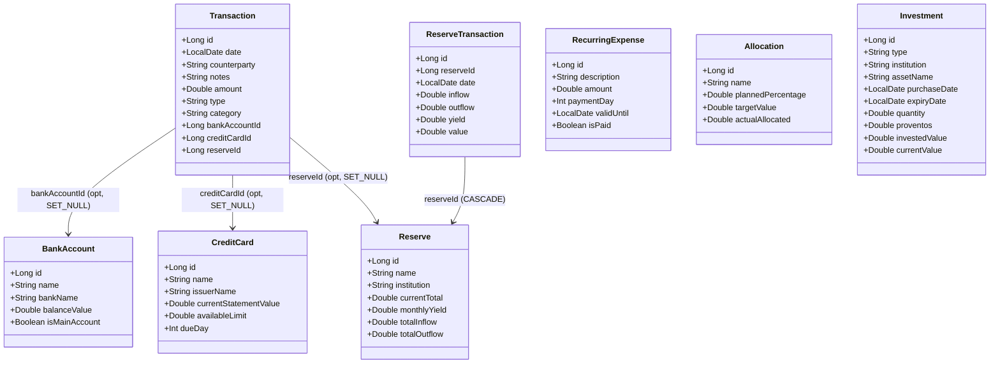

# Data Layer

## Module Overview

| Module | Responsibility |
|---|---|
| `:data:common` | Room DB, all entities, all DAOs, TypeConverters — shared infrastructure |
| `:data:home` | `HomeRepository` — account summary, credit card bills |
| `:data:operations` | `OperationsRepository` — monthly transactions assembled with account names |
| `:data:misc` | `MiscRepository` — reserves + transactions, investments, allocations, recurring expenses |

## Pattern

Each domain module exposes a `Repository` interface backed by a `Local{X}DataSource` that assembles data from DAOs internally. ViewModels receive ready-to-use objects — no joins in UI layer.

```
feature:X  →  data:X (Repository interface)
                  ↓
           Local{X}DataSource  (Room, current)
           Remote{X}DataSource (Retrofit, future)
                  ↓
           data:common (DAOs + DB)
```

Swapping local → remote: rebind the interface in Koin. Zero ViewModel changes.

## Entity Relationships



## Database

- **File:** `comfin.db`
- **Version:** 1
- **Schema exports:** `data/common/schemas/`
- All dates stored as `Long` (epoch day) via `DatabaseConverters`
